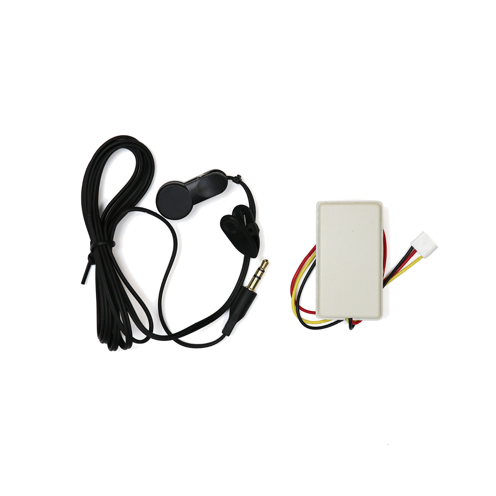

# Pulssensor

## Beschreibung
Der Pulssensor ermöglicht es, den menschlichen Puls am Finger oder Ohr mithilfe der beiliegenden Klammer zu messen. Die Messung erfolgt dabei optisch. Unterschiedliche Blutbewegungen reflektieren das vom Sensor ausgestrahlte grüne Licht unterschiedlich auf den Sensor zurück. Durch die integrierte Messverstärkung und Aufbereitung, wird der Puls direkt ermittelt und ein digitales Signal ausgegeben.

Der Sensor kann direkt oder mithilfe eines Grove Shields an einen Arduino oder Raspberry angeschlossen werden.

Der Pulssensor kann beispielsweise als Teil eines digitalen Sport-Assistenten eingesetzt werden.

Alle weiteren Hintergrundinformationen, sowie ein Beispielaufbau und alle notwendigen Programmbibliotheken sind auf dem offiziellen Wiki (bisher nur in englischer Sprache) von Seeed Studio zusammengefasst. Zusätzlich findet man über alle gängigen Suchmaschinen durch die Eingabe der genauen Komponentenbezeichnungen entsprechende Projektbeispiele und Tutorials.

Die genaue Bezeichnung des Sensors, die bei der Suche von Beschreibungen und Anleitungen wichtig sein kann, lautet PAH8001EI-2G.

## Beispiele

!!!show-examples:./examples/

<!-- infolist -->

## Wichtige Links für die ersten Schritte:

- [Seeed Studio Wiki - Pulssensor](https://wiki.seeedstudio.com/Grove-Ear-clip_Heart_Rate_Sensor/)

## Weiterführende Hintergrundinformationen:

- [Herzfrequenzmessgeräte - Wikipedia Artikel](https://de.wikipedia.org/wiki/Herzfrequenzmessger%C3%A4t)

